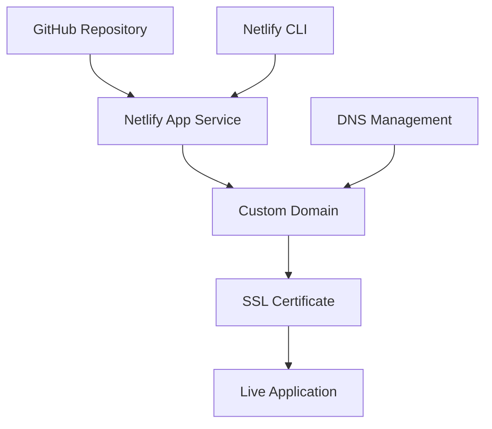

# Aryan Jaiswal – Portfolio

A professional-grade portfolio showcasing technical skills, projects, and achievements. Built using modern full-stack technologies with a strong focus on performance, accessibility, and scalability. This application integrates advanced 3D components using `Three.js` and is deployed through a CI/CD pipeline on Netlify with a custom domain.

[](https://aryanjaiswal.me)
[](LICENSE)
[](https://github.com/Aryanjstar/Aryan_Jaiswal_Portfolio)

---

## 📄 Overview

This portfolio serves as a comprehensive and interactive platform to present personal achievements, technical expertise, and major projects. It leverages modern frontend frameworks and cloud services to ensure a fast, secure, and engaging user experience.

---

## ⚙️ Technology Stack

### Frontend
- **Framework**: Next.js (App Router)
- **Language**: TypeScript
- **Styling**: Tailwind CSS
- **3D Graphics**: Three.js, React Three Fiber
- **Animations**: Framer Motion
- **Component Architecture**: Custom reusable components

### Deployment
- **Hosting**: Netlify
- **CI/CD**: GitHub Actions → Netlify Continuous Deployment
- **Domain**: Custom domain with HTTPS – `aryanjaiswal.me`
- **Security**: Netlify-managed SSL (Let’s Encrypt)

### Performance and Optimization
- Static site generation (SSG)
- Gzip/Brotli compression
- Image optimization via Next.js
- Code splitting and tree shaking

---

## 🧱 Project Structure

```

Aryan\_Jaiswal\_Portfolio/
├── app/                    # Next.js App Router structure
│   ├── layout.tsx          # Root layout
│   ├── page.tsx            # Main landing page
│   └── provider.tsx        # Theme and context provider
├── components/             # All custom components
│   ├── ui/                 # Reusable UI widgets
│   ├── hero.tsx            # Landing section
│   ├── grid.tsx            # About section
│   ├── resume.tsx          # Resume section
│   ├── experience.tsx      # Work experience timeline
│   ├── recent-projects.tsx # Projects showcase
│   └── footer.tsx          # Contact section
├── public/                 # Static assets (images, favicons)
├── config/                 # Application-wide constants/config
├── lib/                    # Utility functions
├── data/                   # Structured data (content)
└── README.md               # Project documentation

````

---

## 🔍 Key Features

- **Interactive 3D Globe** using `Three.js` and `React Three Fiber`
- **Responsive Design** powered by Tailwind CSS
- **Professional Resume** section with downloadable content
- **Project Cards** with links to live demos and GitHub
- **Career Timeline** to showcase internships, roles, and key milestones
- **Modular & Scalable Codebase** using Next.js App Router

---

## 📊 Performance Metrics

- **Lighthouse Scores**: 95+ (Performance, Accessibility, SEO)
- **Load Time**: Under 1 second (static assets + CDN)
- **SEO**: Optimized meta tags and structured data
- **SSL Grade**: A+ (via Let's Encrypt on Netlify)
- **Uptime**: 99.9% Netlify SLA

---

## 🛠️ Local Development Setup

### Prerequisites
- Node.js ≥ 18
- npm / yarn / pnpm

### Getting Started

```bash
# Clone the repository
git clone https://github.com/Aryanjstar/Aryan_Jaiswal_Portfolio.git
cd Aryan_Jaiswal_Portfolio

# Install dependencies
npm install

# Run development server
npm run dev

# Build for production
npm run build

# Preview production build
npm start
````

---

## 🔐 Environment Variables

Minimal environment setup required as this portfolio uses static generation.

For custom configurations (if needed):

```bash
# .env.local
NEXT_PUBLIC_SITE_URL=https://aryanjaiswal.me
```

---

## 📦 Deployment

### Continuous Deployment via Netlify

This project is continuously deployed using Netlify. Every push to the `main` branch triggers an automated build and deployment to the live site.

> **Production URL:** [https://aryanjaiswal.me](https://aryanjaiswal.me)

---

## 🚀 Deployment Architecture


---

## ✅ Security Highlights

* HTTPS enforced via Netlify-managed certificates
* HTTP Strict Transport Security (HSTS)
* Secure headers: CSP, X-Content-Type-Options, X-Frame-Options
* Vulnerability scanning (GitHub Dependabot)

---

## 🧠 Performance Optimizations

* Static Site Generation (SSG)
* Code splitting and tree shaking
* Gzip/Brotli compression
* Lazy-loaded images
* Framer Motion for performant animations

---

## 👤 Author

**Aryan Jaiswal**
Final Year B.Tech CSE @ IIIT Dharwad
Full-stack Developer | MERN | Cloud | Open Source

* 🌐 Portfolio: [aryanjaiswal.me](https://aryanjaiswal.me)
* 📧 Email: [aryanjstar3@gmail.com](mailto:aryanjstar3@gmail.com)
* 🔗 LinkedIn: [linkedin.com/in/aryanjstar](https://linkedin.com/in/aryanjstar)
* 🐙 GitHub: [github.com/Aryanjstar](https://github.com/Aryanjstar)

---

## 📄 License

This project is licensed under the MIT License – see the [LICENSE](LICENSE) file for details.

---

## 🤝 Contributing

While this project is personal, meaningful contributions for performance, accessibility, or security improvements are welcome.

1. Fork this repository
2. Create a feature branch: `git checkout -b feature/improvement`
3. Commit your changes
4. Push the branch: `git push origin feature/improvement`
5. Open a Pull Request

---

*© 2025 Aryan Jaiswal. All rights reserved.*
